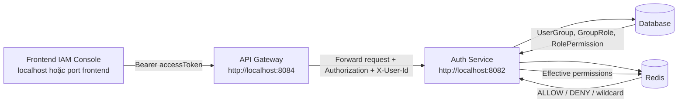
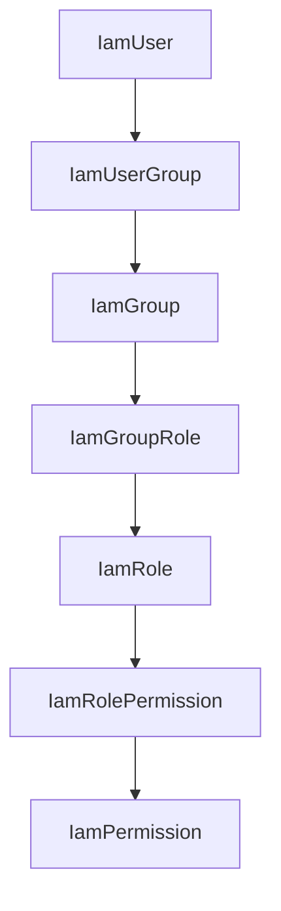
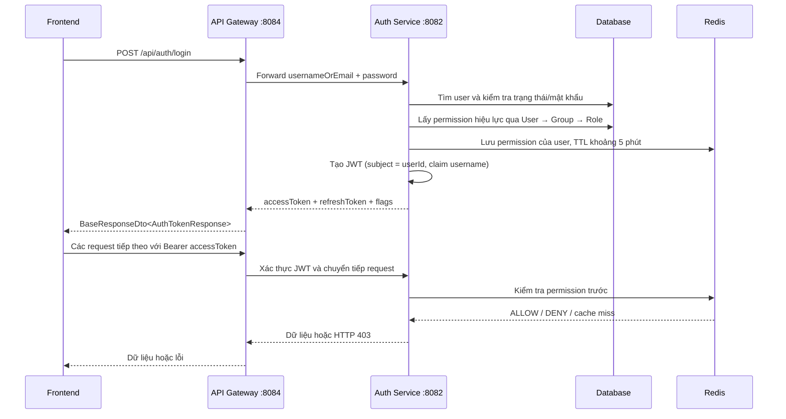
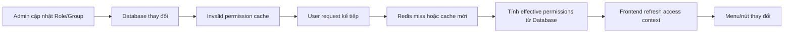

# Luồng dữ liệu hiển thị Frontend theo Role và Permission

## 1. Mục đích

Frontend phải hiển thị giao diện khác nhau tùy theo quyền hiệu lực của tài khoản đang đăng nhập.

Ví dụ:

- Người dùng chỉ có `users:list` được xem danh sách người dùng nhưng không thấy nút tạo, sửa, xóa.
- Người dùng có `roles:list` và `roles:approve` được xem vai trò và gán quyền cho vai trò.
- Người dùng có `users:*` được phép thực hiện các action của resource `users`.
- Tài khoản hệ thống `admin` có thể xem toàn bộ giao diện quản trị theo cơ chế bypass hiện tại của backend.

Frontend chỉ dùng permission để điều khiển hiển thị và trải nghiệm người dùng. Backend vẫn là nơi quyết định cuối cùng việc request có được phép thực thi hay không.

## 2. Kết luận thiết kế

Role không nên được dùng trực tiếp để hard-code giao diện, ví dụ:

```text
nếu role = ADMIN thì hiển thị tất cả
nếu role = USER thì ẩn một số menu
```

Role chỉ là cách gom nhóm permission. Quyết định hiển thị nên dựa trên permission hiệu lực:

```text
User → Group → Role → Permission
```

Khi admin thay đổi role, gán role cho group hoặc gán user vào group, tập permission hiệu lực của user thay đổi. Frontend đọc lại tập permission này và render lại menu/nút tương ứng.

## 3. Kiến trúc và các thành phần tham gia



Mapping service hiện có trong [`application-example.yml`](../common-lib/src/main/resources/application-example.yml):

| Thành phần | Địa chỉ phát triển |
|---|---|
| Frontend gọi API | `http://localhost:8084` |
| API Gateway | `http://localhost:8084` |
| Auth Service nội bộ | `http://localhost:8082` |
| Database/Redis | Được cấu hình trong từng service |

Frontend không gọi trực tiếp database hoặc Redis. Frontend chỉ gọi API Gateway.

## 4. Mô hình dữ liệu phân quyền

### 4.1. Chuỗi gán quyền



Một user có thể thuộc nhiều group. Một group có thể có nhiều role. Một role có thể có nhiều permission. Vì vậy permission hiệu lực của user là tập hợp permission đi qua toàn bộ các quan hệ trên.

### 4.2. Permission code

Permission có dạng:

```text
resource:action
```

Ví dụ:

```text
users:list
users:create
users:update
users:delete
users:*
roles:approve
permissions:update
```

Các resource/action mặc định được khởi tạo trong [`DataInitializer.java`](../auth-service/src/main/java/org/com/auth/config/DataInitializer.java) gồm `users`, `organizations`, `groups`, `roles`, `permissions`, `audit_logs`, `reports`, `workflows`, `settings`.

### 4.3. Hiệu ứng permission

Mỗi permission có một `effect`:

```text
ALLOW
DENY
```

Quy tắc quyết định:

1. Không có permission phù hợp → `deny`.
2. Có ít nhất một permission phù hợp mang `DENY` → `deny`.
3. Không có `DENY` và có `ALLOW` → `allow`.
4. Permission `resource:*` khớp với mọi action của resource đó.

Vì `DENY` được ưu tiên, frontend cũng phải xử lý `DENY` trước `ALLOW` nếu nhận được nhiều bản ghi trùng hoặc cùng wildcard.

## 5. Luồng đăng nhập và nạp permission

### 5.1. Luồng hiện tại



### 5.2. Response login hiện tại

`POST /api/auth/login` trả về dạng:

```json
{
  "accessToken": "<jwt>",
  "refreshToken": "<refresh-token>",
  "mfaRequired": false,
  "mustChangePassword": false
}
```

Response hiện tại chưa chứa trực tiếp:

- `userId` dạng field riêng;
- danh sách role;
- danh sách permission hiệu lực;
- cờ `isSystemAdmin`.

JWT có `subject = userId` và claim `username`, nhưng frontend hiện chỉ lưu token. Vì vậy frontend không nên giả định response login đã chứa role/permission.

## 6. API lấy dữ liệu quyền cho Frontend

### 6.1. Phương án dùng ngay với API hiện có

Sau khi login thành công, frontend có thể:

1. Lấy `userId` từ access token hoặc dùng một API profile hiện có.
2. Gọi:

```http
GET /api/core/auth-service/api/v1/users/{userId}/effective-permissions?page=0&size=100
Authorization: Bearer <accessToken>
```

3. Đọc danh sách trong `data.content`.
4. Chỉ giữ các permission có `effect = ALLOW`, đồng thời loại các code bị `DENY` theo quy tắc ưu tiên.

Response mỗi permission hiện có dạng:

```json
{
  "id": 1,
  "code": "users:list",
  "effect": "ALLOW"
}
```

Endpoint này cho phép user xem quyền của chính mình. Xem quyền của user khác cần `users:list`.

### 6.2. Phương án nên dùng lâu dài: Access Context

Nên bổ sung một endpoint trả về toàn bộ thông tin cần cho lần bootstrap frontend, ví dụ:

```http
GET /api/core/auth-service/api/v1/auth/me/access-context
Authorization: Bearer <accessToken>
```

Response đề xuất:

```json
{
  "user": {
    "id": 10,
    "username": "operator01",
    "fullName": "Operator 01",
    "status": "ACTIVE",
    "organizationId": 1,
    "organizationName": "Root Organization"
  },
  "isSystemAdmin": false,
  "roles": [
    {
      "code": "VIEWER",
      "name": "Viewer User"
    }
  ],
  "permissions": [
    {
      "code": "users:list",
      "effect": "ALLOW"
    },
    {
      "code": "users:read",
      "effect": "ALLOW"
    }
  ]
}
```

Endpoint này giúp frontend không phải tự giải mã JWT hoặc gọi nhiều API để biết user hiện tại là ai. `isSystemAdmin` cũng nên do backend xác định, thay vì frontend hard-code username `admin`.

## 7. Phân biệt System Admin và Role ADMIN

Đây là điểm cần thống nhất rõ:

### 7.1. Tài khoản hệ thống `admin`

Backend hiện có logic đặc biệt:

```java
if ("admin".equalsIgnoreCase(user.getUsername())) {
    return allow("System admin user bypasses permission checks", ...);
}
```

Tài khoản username `admin` được bypass permission trong authorization service. `DataInitializer` cũng tạo mapping:

```text
admin
  → ADMIN_GROUP
      → SUPER_ADMIN
          → các permission dạng resource:*
```

Frontend có thể hiển thị toàn bộ menu cho tài khoản này, nhưng tốt nhất là dựa trên cờ `isSystemAdmin` do backend trả về.

### 7.2. Role `ADMIN` hoặc `SUPER_ADMIN` của user khác

Một user có role code `ADMIN` không tự động có toàn quyền chỉ vì tên role là `ADMIN`. User đó chỉ có quyền nào được gán thông qua group/role.

Ví dụ:

```text
user operator01
  → OPERATIONS_GROUP
      → ADMIN
          → users:list
          → users:update
```

Frontend của `operator01` chỉ hiển thị chức năng tương ứng với hai permission trên.

Nếu muốn user có toàn quyền, admin phải gán các permission cần thiết hoặc wildcard, ví dụ:

```text
users:*
roles:*
groups:*
organizations:*
permissions:*
```

## 8. Ma trận hiển thị Frontend đề xuất

Frontend nên dùng permission ở hai cấp:

- Permission trên menu/module để quyết định có hiển thị section hay không.
- Permission trên action/button để quyết định có hiển thị nút thao tác hay không.

| Module | Hiển thị menu khi có | Các action chính |
|---|---|---|
| Users | `users:list` | Tạo `users:create`, xem `users:read`, sửa `users:update`, xóa `users:delete`, khóa/mở khóa `users:update`, import `users:import`, export `users:export` |
| Roles | `roles:list` | Tạo `roles:create`, sửa `roles:update`, xóa `roles:delete`, gán/thu hồi quyền `roles:approve`, xem liên kết group `roles:list` |
| Permissions | `permissions:list` | Xem chi tiết `permissions:read`, thay đổi ALLOW/DENY `permissions:update`, xem role dùng quyền `permissions:list` |
| Groups | `groups:list` | Tạo `groups:create`, sửa `groups:update`, xóa `groups:delete`, gán user/role `groups:approve`, xem thành viên/vai trò `groups:list` |
| Organizations | `organizations:list` | Tạo `organizations:create`, xem `organizations:read`, sửa `organizations:update`, xóa `organizations:delete`, xem cây tổ chức `organizations:list` |

Nếu permission có wildcard, ví dụ `groups:*`, tất cả action bắt đầu bằng `groups:` được xem là có quyền, trừ trường hợp có `DENY` tương ứng.

## 9. Luồng Frontend sau khi login

### Bước 1: Xóa access context cũ

Trước khi login user mới, xóa permission/role của phiên trước để tránh hiển thị nhầm menu.

```text
clearSession()
clearAccessContext()
```

### Bước 2: Login và lưu token

```text
POST /api/auth/login
→ lưu accessToken và refreshToken
```

Không nên dùng dữ liệu quyền cũ trong `localStorage` làm nguồn duy nhất.

### Bước 3: Tải access context

```text
GET /access-context
hoặc
GET /users/{currentUserId}/effective-permissions
```

Chuẩn hóa permission code về chữ thường, loại khoảng trắng và xây dựng một `permissionMap`.

### Bước 4: Tính quyền hiển thị

Pseudo-code:

```javascript
function can(permissionCode) {
  if (accessContext.isSystemAdmin) {
    return true;
  }

  const code = normalize(permissionCode);
  const [resource, action] = code.split(":");
  const exactCode = `${resource}:${action}`;
  const wildcardCode = `${resource}:*`;

  const matched = accessContext.permissions.filter(permission => {
    const current = normalize(permission.code);
    return current === exactCode || current === wildcardCode;
  });

  if (matched.some(permission => permission.effect === "DENY")) {
    return false;
  }

  return matched.some(permission => permission.effect === "ALLOW");
}
```

### Bước 5: Lọc menu và nút

```javascript
const visibleNavigation = navigation.filter(item => can(item.requiredPermission));

const visibleActions = actions.filter(action => can(action.requiredPermission));
```

Nếu section hiện tại không còn quyền sau khi refresh access context, frontend phải chuyển về section đầu tiên mà user được phép xem hoặc hiển thị màn hình `403`.

### Bước 6: Chỉ tải dữ liệu của module được phép

Không nên luôn gọi đồng thời toàn bộ:

```text
users + roles + permissions + groups + organizations
```

Thay vào đó:

```text
nếu can("users:list")       → gọi API users
nếu can("roles:list")       → gọi API roles
nếu can("permissions:list") → gọi API permissions
nếu can("groups:list")      → gọi API groups
nếu can("organizations:list") → gọi API organizations
```

Điều này giúp giảm request bị `403`, giảm tải backend và tránh hiển thị trạng thái lỗi không cần thiết.

## 10. Luồng request API và xử lý lỗi

Ẩn menu không thay thế cho authorization backend.

```mermaid
flowchart TD
    A[User click button] --> B{Frontend can(permission)?}
    B -->|Không| C[Không render hoặc disable button]
    B -->|Có| D[Gửi request với Bearer token]
    D --> E[Gateway xác thực JWT]
    E --> F[Auth Service kiểm tra Redis/Database]
    F -->|ALLOW| G[Thực thi controller]
    F -->|DENY hoặc thiếu quyền| H[HTTP 403]
    G --> I[Render dữ liệu mới]
    H --> J[Hiển thị không có quyền và refresh access context]
```

Xử lý phía frontend:

| HTTP status | Ý nghĩa | Xử lý |
|---|---|---|
| `401` | Token thiếu, hết hạn hoặc không hợp lệ | Dùng refresh token; nếu refresh thất bại thì xóa session và đưa về login |
| `403` | User đã đăng nhập nhưng không có quyền | Không retry vô hạn; ẩn/disable action và hiển thị thông báo không có quyền |
| `200` | Request được phép | Cập nhật state và render lại màn hình |

## 11. Khi admin thay đổi role hoặc permission

### 11.1. Thay đổi mapping

Ví dụ admin:

1. Gán `users:update` cho role `OPERATOR`.
2. Gán role `OPERATOR` cho group `SALES`.
3. Gán user `operator01` vào group `SALES`.

Luồng dữ liệu:



Backend hiện đã có cơ chế invalidate permission cache trong các thao tác gán/thu hồi role, gán user vào group và toggle effect. Cache permission có TTL khoảng 5 phút.

### 11.2. Frontend cần refresh khi nào

Frontend nên tải lại access context:

- Sau khi login.
- Sau khi refresh token thành công nếu access context đã hết hạn.
- Sau khi nhận `403` do permission đã thay đổi.
- Sau khi admin thay đổi mapping và đang xem chính phiên của mình.
- Khi người dùng bấm nút `Làm mới quyền` hoặc quay lại ứng dụng sau một khoảng thời gian.

## 12. Hiện trạng code Frontend cần lưu ý

Hiện tại [`main.js`](src/main.js) chỉ dùng token để xác định đã đăng nhập:

```javascript
function hasAccess() {
  return Boolean(state.session?.accessToken);
}
```

Sau login, `loadAdminData()` đang gọi đồng thời API của cả users, roles, permissions, groups và organizations. [`admin-view.js`](src/views/admin-view.js) cũng đang render cố định cả 5 menu.

Vì vậy hiện trạng là:

```text
Có accessToken → hiển thị toàn bộ Admin View
Có permission hay không → để backend trả 403 khi gọi API
```

Để đạt mục tiêu của tài liệu này, frontend cần bổ sung:

1. `accessContext` trong store.
2. API lấy user hiện tại và permission hiệu lực.
3. Hàm `can(permissionCode)`.
4. Lọc navigation theo permission.
5. Lọc create/edit/delete/import/export button theo permission.
6. Chỉ gọi API dữ liệu của module mà user có quyền xem.
7. Refresh access context sau lỗi `403` hoặc sau khi quyền thay đổi.

## 13. Những điểm không nên dùng làm nguồn phân quyền

Không nên:

- Chỉ kiểm tra tên role ở frontend.
- Chỉ kiểm tra username `admin` bằng code hard-code ở frontend.
- Tin rằng ẩn nút đồng nghĩa với bảo mật.
- Đưa toàn bộ permission vào JWT nếu permission thường xuyên thay đổi mà không có cơ chế revoke/token refresh phù hợp.
- Gọi toàn bộ API rồi mới ẩn dữ liệu.
- Dùng dữ liệu permission cũ trong `localStorage` mà không refresh từ backend.

Đặc biệt, API hiện tại `GET /api/core/auth-service/api/v1/permissions/can?permission=...` chưa phải lựa chọn tốt để tải toàn bộ quyền giao diện vì:

- Nó kiểm tra từng permission một, dẫn đến nhiều request.
- Phần kiểm tra code hiện tại không thể hiện đầy đủ wildcard giống `PermissionAuthorizationService`.
- Nhánh có quyền trong `PermissionServiceImpl` hiện trả `data = null` thay vì `data = true`.

Vì vậy nên dùng một access context hoặc danh sách effective permissions một lần khi bootstrap frontend.

## 14. Tiêu chí nghiệm thu

### System Admin

- Đăng nhập bằng tài khoản system admin.
- Hiển thị toàn bộ 5 module và toàn bộ action.
- Backend vẫn cho phép request theo cơ chế bypass hiện tại.

### User chỉ có quyền đọc

Ví dụ permission:

```text
users:list
users:read
```

Kỳ vọng:

- Thấy menu Users.
- Thấy danh sách và chi tiết.
- Không thấy nút tạo, sửa, xóa, khóa, import, export.
- Nếu cố tình gọi API ghi dữ liệu, backend trả `403`.

### User có wildcard

Ví dụ:

```text
groups:*
```

Kỳ vọng:

- Có thể xem và thao tác các action của resource `groups`.
- Nếu có thêm `DENY` phù hợp, `DENY` phải được ưu tiên.

### User không có permission

- Không thấy module tương ứng.
- Không được gọi API danh sách tương ứng.
- Nếu truy cập URL trực tiếp, frontend hiển thị `403` hoặc chuyển về module được phép.

## 15. Tài liệu và mã nguồn liên quan

- [`DataInitializer.java`](../auth-service/src/main/java/org/com/auth/config/DataInitializer.java): tạo role, permission và mapping mặc định.
- [`PermissionAuthorizationServiceImpl.java`](../auth-service/src/main/java/org/com/auth/service/impl/PermissionAuthorizationServiceImpl.java): quyết định ALLOW/DENY từ database/cache.
- [`PermissionDecisionCacheServiceImpl.java`](../auth-service/src/main/java/org/com/auth/service/impl/PermissionDecisionCacheServiceImpl.java): kiểm tra Redis, wildcard và TTL.
- [`PermissionAuthorizationFilter.java`](../auth-service/src/main/java/org/com/auth/filter/PermissionAuthorizationFilter.java): ánh xạ request HTTP thành resource/action và chặn request không có quyền.
- [`AuthServiceImpl.java`](../auth-service/src/main/java/org/com/auth/service/impl/AuthServiceImpl.java): login, tạo JWT và nạp permission vào Redis.
- [`UserController.java`](../auth-service/src/main/java/org/com/auth/controller/UserController.java): API user và effective permissions.
- [`PermissionController.java`](../auth-service/src/main/java/org/com/auth/controller/PermissionController.java): API kiểm tra quyền và danh sách permission.
- [`main.js`](src/main.js): login, load dữ liệu và render hiện tại.
- [`admin-view.js`](src/views/admin-view.js): menu và action đang được render cố định.
