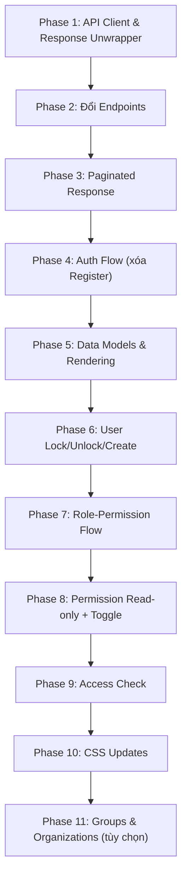

# Migration Plan: Cập nhật UI theo API Microservice mới

## Bối cảnh

Dự án hiện tại là một **Single-Page Admin Console** (Vanilla JS, không framework) đang kết nối tới API cũ trên **port `8080`** với cấu trúc response đơn giản (trả data trực tiếp). Cần chuyển sang API mới theo kiến trúc **microservice** với **API Gateway port `8084`**, cấu trúc response wrapper `BaseResponseDto<T>`, và các module mới (Groups, Organizations).

---

## Tổng hợp sự khác biệt Cũ → Mới

| Hạng mục | API Cũ (hiện tại) | API Mới (tài liệu) |
|:---|:---|:---|
| **Base URL** | `http://localhost:8080` | `http://localhost:8084` |
| **Login endpoint** | `POST /api/auth/login` | `POST /api/auth/login` (giữ nguyên path) |
| **Login request** | `{ email, password }` | `{ usernameOrEmail, password }` |
| **Login response** | Trả data trực tiếp `{ accessToken, refreshToken, roles, ... }` | Wrapper: `{ status: {...}, data: { accessToken, refreshToken, mfaRequired, mustChangePassword } }` |
| **Refresh token** | `POST /api/auth/refresh` | `POST /api/auth/refresh-token` |
| **Register** | `POST /api/auth/register` | ❌ **Không còn** (thay bằng tạo User qua Admin API) |
| **Users** | `/api/users` | `/api/core/auth-service/api/v1/users` |
| **User response** | `{ id, fullName, email, phone, roles, ... }` | `{ id, uuid, username, email, fullName, phone, organizationId, organizationCode, organizationName, status, ... }` |
| **User roles** | `PUT /api/users/{id}/roles` gửi `{ roles: [...] }` | ❌ Không còn endpoint trực tiếp — quản lý qua **Groups** |
| **Roles** | `/api/roles` | `/api/core/auth-service/api/v1/roles` |
| **Role response** | `{ id, name, description, permissions }` | `{ id, uuid, code, name, description, system, status, ... }` |
| **Role permissions** | `PUT /api/roles/{id}/permissions` gửi `{ permissions: [...] }` | `POST /api/.../roles/{id}/permissions` gửi `{ permissionIds: [1,2,3] }` |
| **Permissions** | `/api/permissions` — CRUD đầy đủ | `/api/core/auth-service/api/v1/permissions` — chỉ **read** + toggle effect |
| **Permission response** | `{ id, name, description }` | `{ id, uuid, code, name, resource, action, effect, ... }` |
| **Groups** | ❌ Không có | ✅ Module mới `/api/core/auth-service/api/v1/groups` |
| **Organizations** | ❌ Không có | ✅ Module mới `/api/core/auth-service/api/v1/organizations` |
| **Phân trang** | Không có | Spring `Page<T>` với `page`, `size`, `sort` query params |
| **Response format** | Trả data trực tiếp (JSON object/array) | Wrapped: `{ status: { code, message, displayMessage, traceId }, data: ... }` |
| **Error format** | `{ message: "..." }` | `{ status: { code, message, displayMessage, traceId }, data: null }` |
| **Permission check** | Client-side bằng `permissions[]` từ login | API mới: `GET /api/.../permissions/can?permission=users:create` |
| **Lock/Unlock user** | ❌ Không có | ✅ `POST /users/{id}/lock`, `POST /users/{id}/unlock` |
| **Import/Export Excel** | ❌ Không có | ✅ `POST /users/import`, `GET /users/export` |

---

## User Review Required

> [!IMPORTANT]
> **Xóa bỏ chức năng Register:** API mới không có endpoint `/api/auth/register`. Thay vào đó, việc tạo user mới sẽ thông qua Admin API `POST /api/v1/users`. Tab "Đăng ký" trên trang login sẽ bị loại bỏ.

> [!IMPORTANT]
> **Quản lý User-Role thay đổi:** API cũ gán vai trò trực tiếp cho user (`PUT /api/users/{id}/roles`). API mới gán user vào **Group** rồi gán **Role** cho Group. Cần chuyển đổi flow "Gán vai trò" sang "Gán nhóm cho user" / "Gán vai trò cho nhóm".

> [!WARNING]
> **Tệp `app.js` là monolith (728 dòng):** File này chứa toàn bộ logic: API client, state, rendering, handlers. Plan sẽ cập nhật trực tiếp file này vì không sử dụng module bundler (file được load trực tiếp qua `<script>`). Các file `src/main.js`, `src/api-client.js`, `src/store.js`, `src/views/*.js` dùng ES Module import nhưng **không được tham chiếu trong `index.html`** — chỉ `app.js` được load.

---

## Open Questions

> [!IMPORTANT]
> 1. **Có cần giữ lại module "Quyền truy cập" (Permissions CRUD)?** API mới chỉ hỗ trợ **đọc** danh sách permissions và **toggle effect** (ALLOW↔DENY), không còn CRUD. Nên chuyển sang chế độ chỉ-đọc + toggle?
> 
> 2. **Phân trang UI:** API mới trả về phân trang Spring. Có cần UI phân trang (nút trang trước/sau, chọn số dòng mỗi trang) hay cứ load hết (size lớn)?
>
> 3. **Modules Groups và Organizations:** Có muốn thêm 2 tab mới trên sidebar cho quản lý Nhóm và Tổ chức ngay trong lần cập nhật này không? Hay chỉ cập nhật các module cũ trước?
>
> 4. **Import/Export Excel cho Users:** Có cần triển khai chức năng import/export Excel trong lần cập nhật này?

---

## Proposed Changes

### Phase 1: API Client & Response Adapter

#### [MODIFY] [app.js](file:///c:/Users/ASUS/Downloads/UIdemo-microservice/src/app.js)

**1.1. Đổi `BASE_URL` từ port 8080 → 8084**
```diff
-const BASE_URL = "http://localhost:8080";
+const BASE_URL = "http://localhost:8084";
```

**1.2. Thêm response unwrapper** — API mới wrap tất cả trong `{ status, data }`. Hàm `request()` cần extract `.data`:
```diff
 async function request(path, options = {}) {
   const response = await fetch(`${BASE_URL}${path}`, { ... });
   if (response.status === 204) return null;
   const json = await response.json().catch(() => null);
   if (!response.ok) {
-    const error = new Error(data?.message || `Yêu cầu không thành công...`);
+    const msg = json?.status?.displayMessage || json?.status?.message || `Yêu cầu không thành công. Mã lỗi ${response.status}.`;
+    const error = new Error(msg);
     error.status = response.status;
+    error.traceId = json?.status?.traceId;
     throw error;
   }
-  return data;
+  // Unwrap BaseResponseDto: trả về phần data bên trong
+  return json?.data !== undefined ? json.data : json;
 }
```

**1.3. Đổi endpoint refresh token:**
```diff
-const nextSession = await request("/api/auth/refresh", { ... });
+const nextSession = await request("/api/auth/refresh-token", { ... });
```

**1.4. Cập nhật login request field:**
```diff
-return request("/api/auth/login", { method: "POST", body: payload });
+// Chuyển email → usernameOrEmail
+const body = { usernameOrEmail: payload.email || payload.usernameOrEmail, password: payload.password };
+return request("/api/auth/login", { method: "POST", body });
```

---

### Phase 2: Cập nhật API Endpoints (Routing mới)

#### [MODIFY] [app.js](file:///c:/Users/ASUS/Downloads/UIdemo-microservice/src/app.js)

Đổi toàn bộ đường dẫn API:

| Cũ | Mới |
|:---|:---|
| `/api/users` | `/api/core/auth-service/api/v1/users` |
| `/api/users/{id}` | `/api/core/auth-service/api/v1/users/{id}` |
| `/api/roles` | `/api/core/auth-service/api/v1/roles` |
| `/api/roles/{id}` | `/api/core/auth-service/api/v1/roles/{id}` |
| `/api/permissions` | `/api/core/auth-service/api/v1/permissions` |
| `/api/permissions/{id}` | `/api/core/auth-service/api/v1/permissions/{id}` |

Thêm endpoint prefix constant:
```javascript
const API_PREFIX = "/api/core/auth-service/api/v1";
```

Cập nhật từng hàm:
```diff
-function listUsers() { return authRequest("/api/users"); }
-function getUser(id) { return authRequest(`/api/users/${id}`); }
+function listUsers(page = 0, size = 50) { return authRequest(`${API_PREFIX}/users?page=${page}&size=${size}`); }
+function getUser(id) { return authRequest(`${API_PREFIX}/users/${id}`); }
```

_(Tương tự cho roles, permissions)_

---

### Phase 3: Cập nhật Paginated Response Handling

#### [MODIFY] [app.js](file:///c:/Users/ASUS/Downloads/UIdemo-microservice/src/app.js)

Hàm `toList()` hiện tại đã hỗ trợ `value?.content` nên Spring `Page<T>` sẽ tự động extract. Cần bổ sung lưu thông tin phân trang:

```javascript
function extractPage(response) {
  if (response && Array.isArray(response.content)) {
    return {
      items: response.content,
      totalElements: response.totalElements || 0,
      totalPages: response.totalPages || 1,
      page: response.number || 0,
      size: response.size || 10,
    };
  }
  // Fallback: nếu response là array thuần
  const items = Array.isArray(response) ? response : [];
  return { items, totalElements: items.length, totalPages: 1, page: 0, size: items.length };
}
```

---

### Phase 4: Xóa Register, cập nhật Auth Flow

#### [MODIFY] [app.js](file:///c:/Users/ASUS/Downloads/UIdemo-microservice/src/app.js)

**4.1. Xóa hàm `register()` và `registerUser()`**

**4.2. Xóa toggle Login/Register trong `renderAuthView()`** — chỉ giữ form đăng nhập

**4.3. Cập nhật login form field name từ `email` → `usernameOrEmail`:**
```diff
-${field("Email", "email", "email", "admin@cuongtay.local")}
+${field("Tên đăng nhập hoặc Email", "usernameOrEmail", "text", "admin")}
```

**4.4. Cập nhật `loginUser()`** — API mới không trả `roles/permissions` trong login response, thay vào đó trả `mfaRequired`, `mustChangePassword`:
```javascript
async function loginUser(form) {
  clearAuthCache();
  const data = await login(readForm(form));
  // data = { accessToken, refreshToken, mfaRequired, mustChangePassword }
  if (data.mfaRequired) {
    throw new Error("Tài khoản yêu cầu xác thực 2 bước (MFA). Chức năng này chưa được hỗ trợ trên giao diện.");
  }
  saveSession(data);
  await loadAdminData("Đăng nhập thành công.");
}
```

**4.5. Bỏ kiểm tra `hasPermissionSnapshot()`** — API mới không trả permissions trong login response.

---

### Phase 5: Cập nhật Data Models & Rendering

#### [MODIFY] [app.js](file:///c:/Users/ASUS/Downloads/UIdemo-microservice/src/app.js)

**5.1. User model mới:** Thêm hiển thị `username`, `status`, `organizationName`:
```javascript
// Trong renderRow cho users:
return `<div class="table-row">
  <div><strong>${item.fullName || item.username}</strong>
    <div class="meta">@${item.username} • Mã ${item.id}</div>
  </div>
  <div><strong>${item.email}</strong>
    <div class="meta">${item.phone || "—"}</div>
  </div>
  <div>${statusBadge(item.status)}${item.organizationName ? ` <span class="meta">${item.organizationName}</span>` : ""}</div>
  <div class="table-actions">...</div>
</div>`;
```

**5.2. Role model mới:** Thêm hiển thị `code`, `status`, `system` flag:
```javascript
// Role row: hiển thị code và trạng thái
`<strong>${item.name}</strong><div class="meta">${item.code} • ${item.system ? "Hệ thống" : "Tùy chỉnh"}</div>`
```

**5.3. Permission model mới:** Hiển thị `code`, `resource`, `action`, `effect`:
```javascript
// Permission row: hiển thị theo dạng resource:action + effect badge  
`<strong>${item.name}</strong><div class="meta">${item.code}</div>`
// Chi tiết: hiển thị resource, action, effect toggle
```

**5.4. Table headers:** Cập nhật headers phù hợp:
```javascript
const head = {
  users: ["Thông tin", "Liên hệ", "Trạng thái & Đơn vị", "Thao tác"],
  roles: ["Vai trò", "Mô tả", "Trạng thái", "Thao tác"],
  permissions: ["Quyền", "Tài nguyên/Hành động", "Hiệu lực", "Thao tác"]
};
```

---

### Phase 6: Cập nhật User Actions (Lock/Unlock, Create)

#### [MODIFY] [app.js](file:///c:/Users/ASUS/Downloads/UIdemo-microservice/src/app.js)

**6.1. Thêm API functions mới:**
```javascript
function lockUser(id, reason) { 
  return authRequest(`${API_PREFIX}/users/${id}/lock`, { method: "POST", body: { reason } }); 
}
function unlockUser(id) { 
  return authRequest(`${API_PREFIX}/users/${id}/unlock`, { method: "POST" }); 
}
function createUser(body) {
  return authRequest(`${API_PREFIX}/users`, { method: "POST", body });
}
```

**6.2. Cập nhật `createUserForm()`** — thêm field `username`, `organizationId`:
```javascript
function createUserForm() {
  return formWrap("create-user-form", "", `
    ${input("username", "Tên đăng nhập", "")}
    ${input("fullName", "Họ và tên", "")}
    ${input("email", "Email", "", "email")}
    ${input("password", "Mật khẩu", "", "password")}
    ${input("phone", "Số điện thoại", "", "tel", false)}
    ${input("organizationId", "Mã đơn vị", "", "number")}
  `, "Thêm người dùng");
}
```

**6.3. Thêm Lock/Unlock buttons** trong user row actions:
```javascript
// Nếu user.status === "ACTIVE": hiện nút "Khóa"
// Nếu user.status === "LOCKED": hiện nút "Mở khóa"
```

**6.4. Thêm status badge helper:**
```javascript
function statusBadge(status) {
  const map = {
    ACTIVE: { label: "Hoạt động", cls: "pill-success" },
    LOCKED: { label: "Bị khóa", cls: "pill-danger" },
    DISABLED: { label: "Vô hiệu", cls: "pill-muted" },
    PENDING: { label: "Chờ kích hoạt", cls: "pill-warning" }
  };
  const s = map[status] || { label: status, cls: "pill-muted" };
  return `<span class="pill ${s.cls}">${s.label}</span>`;
}
```

---

### Phase 7: Cập nhật Role Permissions Flow

#### [MODIFY] [app.js](file:///c:/Users/ASUS/Downloads/UIdemo-microservice/src/app.js)

**7.1. Gán quyền cho vai trò:** API mới dùng `POST /roles/{id}/permissions` với `{ permissionIds: [...] }` (gửi ID, không phải name):
```diff
-function updateRolePermissions(id, permissions) { return authRequest(`/api/roles/${id}/permissions`, { method: "PUT", body: { permissions } }); }
+function assignRolePermissions(id, permissionIds) { return authRequest(`${API_PREFIX}/roles/${id}/permissions`, { method: "POST", body: { permissionIds } }); }
```

**7.2. Thu hồi quyền:** API mới dùng `DELETE /roles/{roleId}/permissions/{permissionId}`:
```javascript
function removeRolePermission(roleId, permissionId) { 
  return authRequest(`${API_PREFIX}/roles/${roleId}/permissions/${permissionId}`, { method: "DELETE" }); 
}
```

**7.3. Lấy danh sách quyền của role:** `GET /roles/permissions/{roleId}`:
```javascript
function listRolePermissions(roleId, page = 0, size = 50) { 
  return authRequest(`${API_PREFIX}/roles/permissions/${roleId}?page=${page}&size=${size}`); 
}
```

**7.4. Cập nhật checklist form** — value phải là `id` thay vì `name`:
```diff
-value="${entry.name}" ${selected.includes(entry.name) ? "checked" : ""}
+value="${entry.id}" ${selectedIds.includes(entry.id) ? "checked" : ""}
```

---

### Phase 8: Cập nhật Permission Section (Read-only + Toggle)

#### [MODIFY] [app.js](file:///c:/Users/ASUS/Downloads/UIdemo-microservice/src/app.js)

**8.1. Xóa CRUD permissions** (createPermission, updatePermission, deletePermission)

**8.2. Thêm toggle effect:**
```javascript
function togglePermissionEffect(id) { 
  return authRequest(`${API_PREFIX}/permissions/${id}/toggle-effect`, { method: "PUT" }); 
}
```

**8.3. Thêm permission tree:**
```javascript
function getPermissionTree(page = 0, size = 50) { 
  return authRequest(`${API_PREFIX}/permissions/permission-tree?page=${page}&size=${size}`); 
}
```

**8.4. Cập nhật permission row** — bỏ nút "Sửa", "Xóa", thêm nút "Toggle Effect":
```javascript
// Permission row actions:
`<button class="ghost-btn" data-action="toggle-permission-effect" data-id="${item.id}">
  ${item.effect === "ALLOW" ? "Chuyển DENY" : "Chuyển ALLOW"}
</button>`
```

---

### Phase 9: Cập nhật Access Check (loại bỏ client-side permissions)

#### [MODIFY] [app.js](file:///c:/Users/ASUS/Downloads/UIdemo-microservice/src/app.js)

API mới không trả `permissions[]` trong login response. Có 2 hướng:

**Hướng đề xuất: Cho phép truy cập tất cả section sau login, để backend reject bằng HTTP 403.**

```diff
-function hasAccess() {
-  return Boolean(state.session?.accessToken);
-}
+function hasAccess() {
+  return Boolean(state.session?.accessToken);
+}
// Giữ nguyên, nhưng bỏ can() checks ở UI — dùng safeRequest() để catch 403
```

Hoặc sử dụng `GET /permissions/can?permission=xxx` để kiểm tra từng quyền khi cần (lazy check).

---

### Phase 10: Cập nhật CSS — Status Badges mới

#### [MODIFY] [app.css](file:///c:/Users/ASUS/Downloads/UIdemo-microservice/styles/app.css)

Thêm styles cho status badges:
```css
.pill-success { background: var(--success-soft); color: var(--success); }
.pill-danger { background: var(--danger-soft); color: var(--danger); }
.pill-warning { background: #fff8e1; color: #c77c00; }
.pill-muted { background: var(--surface-2); color: var(--muted); }
.pill-allow { background: var(--success-soft); color: var(--success); }
.pill-deny { background: var(--danger-soft); color: var(--danger); }
```

---

### Phase 11 (Tùy chọn): Thêm module Groups & Organizations

> Nếu được duyệt, sẽ thêm:

#### [MODIFY] [app.js](file:///c:/Users/ASUS/Downloads/UIdemo-microservice/src/app.js)

- Thêm 2 section mới vào sidebar: `groups`, `organizations`
- Thêm state: `data.groups: []`, `data.organizations: []`
- Thêm API functions cho Groups (CRUD + assign users, assign roles)
- Thêm API functions cho Organizations (CRUD + tree view)
- Thêm render functions tương ứng
- Thêm form tạo/sửa Group (code, name, description, organizationId)
- Thêm form tạo/sửa Organization (code, name, description, parentId)

#### [MODIFY] [app.css](file:///c:/Users/ASUS/Downloads/UIdemo-microservice/styles/app.css)

- Styles cho organization tree view (indent levels)
- Group member list styles

---

## Tóm tắt thứ tự triển khai



---

## Verification Plan

### Manual Verification
1. **Login flow:** Đăng nhập bằng `admin` / `Password@123` → nhận token, redirect vào admin
2. **Users list:** Hiển thị danh sách users với thông tin mới (username, status, organization)
3. **CRUD Users:** Tạo, sửa, xóa, khóa, mở khóa user
4. **Roles:** Tạo, sửa, xóa role → gán quyền cho role
5. **Permissions:** Xem danh sách, toggle effect ALLOW↔DENY
6. **Error handling:** Kiểm tra hiển thị lỗi từ `status.displayMessage`
7. **Refresh token:** Để token hết hạn → kiểm tra tự động refresh
8. **Responsive:** Kiểm tra layout trên mobile/tablet
